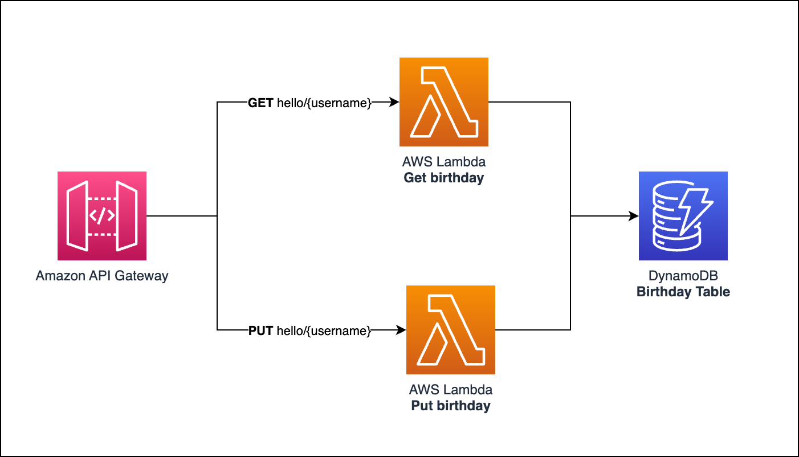
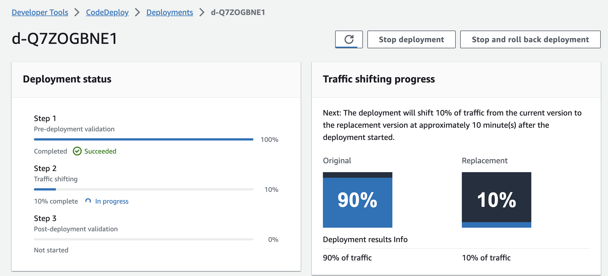
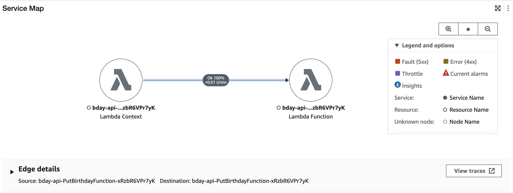

[](https://codecov.io/github/victoraldir/sam-go-api)

[![LinkedIn][linkedin-shield]][linkedin-url]

<!-- PROJECT LOGO -->
<br />
<p align="center">
  <a href="#">
    
  </a>

<h3 align="center">Task Parser / Executer</h3>

  <p align="center">
    Birthday countdown API written in Golang and deployed using AWS SAM.
    <br />
    <a href="https://linktr.ee/victoraldir"><strong>By Victor Hugo ❤️ »</strong></a>
    <br />
    <br />
  </p>
</p>

# SAM Go API

<p align="center">
  
</p>

This is a sample application that uses [AWS Serverless Application Model (SAM)](https://aws.amazon.com/serverless/sam/) to build a simple API written in Golang. The API supports the following operations:

* `GET /hello/<username>`: Returns hello birthday `json message` for the given user.
* `PUT /hello/<username>`: Saves/updates the given user’s name and date of birth in the database.

The API is defined in the [template.yaml](template.yaml) file in this project. This file uses the SAM template format and CloudFormation syntax to declare the API resources (e.g. API Gateway, Lambda) used in the application.


Below is a brief explanation of the project structure:

```bash
.
├── Makefile                    <-- Make to automate build
├── README.md                   <-- This instructions file
├── app                         <-- Source code for the lambda functions
└── template.yaml               <-- SAM template
```

## Requirements

* AWS CLI already configured with Administrator permission
* [Docker installed](https://www.docker.com/community-edition)
* [Golang](https://golang.org)
* SAM CLI - [Install the SAM CLI](https://docs.aws.amazon.com/serverless-application-model/latest/developerguide/serverless-sam-cli-install.html)

## Setup process

### Installing dependencies & building the target 

In this example we use the built-in `sam build` to automatically download all the dependencies and package our build target.   
Read more about [SAM Build here](https://docs.aws.amazon.com/serverless-application-model/latest/developerguide/sam-cli-command-reference-sam-build.html) 

The `sam build` command is wrapped inside of the `Makefile`. To execute this simply run
 
```shell
make
```

### Local development

**Invoking function locally through local API Gateway**

This project uses dynamodDB as a database. To run dynamoDB locally, run the following command:

```bash
make run-local
```

If the previous command ran successfully you should now be able to hit the following local endpoint to invoke the functions:

* http://127.0.0.1:3000/hello/{username} [PUT]  
* http://127.0.0.1:3000/hello/{username} [GET]

### Deployment strategy

This API is configured to automatically deploy changes using **Canary10Percent5Minutes** deployment strategy. This means that every time a new version of the API is deployed, 10% of the traffic is routed to the new version and 90% to the old version. After 5 minutes, 100% of the traffic is routed to the new version.

Clouddeploy will look check the status of alarms and if they are in `ALARM` state, the deployment will be rolled back.

<p align="center">
  
</p>


### Observability

This API is configured to send logs to CloudWatch and X-Ray. To see the logs, go to the CloudWatch console and look for the `/aws/lambda/bday-api-*` log group(s).

To see the traces, go to the X-Ray console and look for the `bday-api-*` service map.

<p align="center">
  
</p>

[linkedin-shield]: https://img.shields.io/badge/-LinkedIn-black.svg?style=for-the-badge&logo=linkedin&colorB=555
[linkedin-url]: https://linkedin.com/in/victoraldir
[dot]: assets/dot-on.png